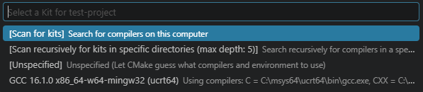
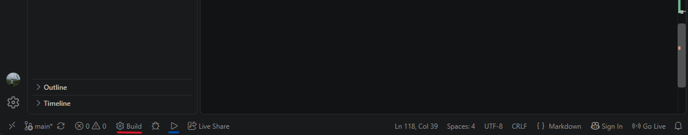
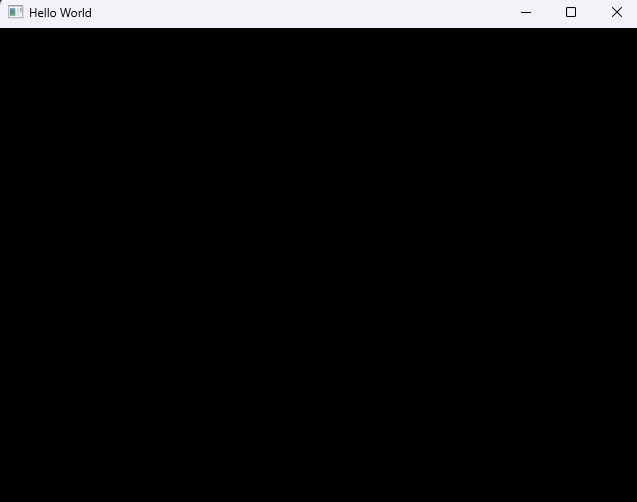
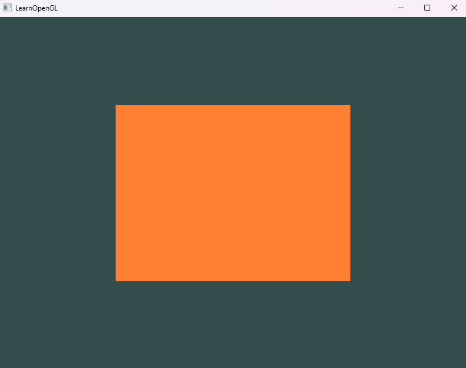

# OpenGL GLFW & GLAD Setup Guide for VS Code (WINDOWS)

Welcome to this repository! This guide provides a straightforward, logical approach to setting up a modern Computer Graphics environment using OpenGL, GLFW, and GLAD in Visual Studio Code especially in Windows.

## What is OpenGL, GLFW, and GLAD?
- **OpenGL (Open Graphics Library):** This is not a library or a complete program, but purely a "rulebook" or standard specification. OpenGL only contains mathematical functions for drawing graphics, but it is "blind" to your computer's operating system.
- **GLFW (Graphics Library Framework):** This is an actual library (a collection of assembled C codes). Since OpenGL does not know how to create application windows or read keyboard inputs on Windows, GLFW steps in to take over this task. It creates an empty canvas (window) and captures your keystrokes so OpenGL has a medium to draw on.
- **GLAD (Graphics Loader):** Because OpenGL is just a rulebook, your computer does not know exactly where those graphic functions are stored inside your graphics card. GLAD acts as an address loader; it tracks and maps these functions so your C++ code can communicate directly with your specific GPU hardware.

## Prerequisites
Before proceeding, ensure your system meets the following requirements:
*   **Operating System:** Windows 10 or 11 (64-bit).
*   **Internet Connection:** Required for downloading MSYS2 packages and GLAD generation.
*   **Editor:** Visual Studio Code installed.

## Installation Steps
### Install MSYS2 (Compiler for C/C++)
1. **Install MSYS2** from the [official website](https://msys2.org). Once installed, open the **MSYS2 UCRT64** terminal and run this combined command to install the MinGW-w64 toolchain and CMake:
```bash
pacman -S --needed base-devel mingw-w64-ucrt-x86_64-toolchain mingw-w64-ucrt-x86_64-cmake
```
2. **Configure Environment Variables**
    - Open the Windows Search bar and type `Edit the System Environment Variables`, then press Enter.
    - Click the `Environment Variables` button at the bottom.
    
    
    
    - In your `User Variables`, select the `Path` variable and the select `Edit` or double click it

    

    - Select `New` and add the ucrt64 bin folder path to the list. The default path should be: `C:\msys64\ucrt64\bin`, unless you change the installation path during MSYS2 installation setup and then select `OK`.

    

    - Select `OK`, and then select `OK` again in the `Environment Variables` window to update the `PATH` environment variable. You have to reopen any console windows for the updated `PATH` environment variable to be available.
    
    

    

3. Open a fresh Command Prompt (CMD) or PowerShell window and run the following commands to verify that the compiler and debugger are successfully installed:
```bash
gcc --version
g++ --version
gdb --version
```
### Installing C/C++ Extension Pack on Visual Studio Code
1. Open your Visual Studio Code and go to `Extensions` or click `CTRL + SHIFT + X`.
2. Search for C/C++ and CMake Tools Extension Pack by Microsoft and then install it.

### Install GLFW
1. **Open GLFW** from the [official website](https://www.glfw.org) and go download through this [download link](https://www.glfw.org/download.html). 
2. Windows users must specifically select the 64-bit pre-compiled binaries package. This specific version is highly required to ensure flawless compatibility with our modern MSYS2 UCRT64 systems.
3. After the downloading process completes, locate the ZIP file on your local storage. You must extract the compressed folder carefully and open the newly extracted directory to view all available files.
4. Copy the entire `include` folder directly into your dependencies directory. Also, the `lib-mingw-w64` folder and securely copy it into the `dependencies/lib` folders of your projects.

### Install GLAD
1. Go to GLAD [official website](https://glad.dav1d.de/).
2. Select C/C++ for the **Language**, OpenGL for **Specification**, API gl in **latest version**.
3. Navigate to the bottom of the webpage and click `Generate`. After the loading completes, you must download the provided ZIP file `glad.zip` and extract it
4. Copy `include` folder and `src` contents to your dependencies directory.

### Configure tasks.json (If dont use CMake)
1. Create a .cpp file (for example, test-glfw.cpp). Go to `Terminal` > `Configure Default Build Task` > and select `C/C++ g++.exe build active`. It will generate `tasks.json` file inside `.vscode` directory in your project directory.
2. Open `tasks.json` and update the `args` array to match your local setup. Here is the breakdown of what each flag does:
   * `-I`: Points to your project's `include` directory.
   * `-L`: Points to your project's `lib` directory.
   * `glad.c`: The exact file path to your GLAD source code.
   * `-l`: Links the required external libraries (`glfw3`, `opengl32`, and `gdi32`) to compile the project successfully.

```json
"args": [
    "-fdiagnostics-color=always",
    "-g",
    "-I${workspaceFolder}\\dependencies\\include",
    "-L${workspaceFolder}\\dependencies\\lib",
    "${workspaceFolder}\\dependencies\\src\\glad.c",
    "${file}",
    "-lglfw3",
    "-lopengl32",
    "-lgdi32",
    "-o",
    "${fileDirname}\\${fileBasenameNoExtension}.exe"
]
```

### If Using CMake and Run the file
1. Create a plain text file `CMakeLists.txt` in your project root directory and fill it with this configuration:
```cmake
# Specify the minimum required version of CMake
cmake_minimum_required(VERSION 3.10)

# Define the project name
project(ProjectOpenGL)

# Tell the compiler where to find the header (include) files
include_directories("${CMAKE_SOURCE_DIR}/dependencies/include")

# Combine your main source file and glad.c into a single executable target
add_executable(name_executable
    name_file.cpp # Adjust the filename and the executable name
    "${CMAKE_SOURCE_DIR}/dependencies/src/glad.c"
)

# Specify the directory where the required library files are located
target_link_directories(name_executable PRIVATE "${CMAKE_SOURCE_DIR}/dependencies/lib")

# Link the essential external libraries and Windows core graphics subsystems
target_link_libraries(name_executable glfw3 opengl32 gdi32)
```
2. Press the `Ctrl + Shift + P` keys on your keyboard. A search bar will appear at the top center of the screen. Type this command: `CMake: Select a Kit` and Press Enter. The system will immediately display a list of available compilers. Select GCC (UCRT64) from the list.



3. Click the `Build` button `(gear icon)` on the same bottom bar. CMake will automatically generate a new build directory and compile your project flawlessly.

4. Once the build is complete, click the Play icon (Launch) located right next to the Build button to run your application.
**Note:** CMake is highly scalable and perfect for Object-Oriented Programming (OOP) architectures where you need to compile multiple files simultaneously. Just remember to register any new .cpp files into the `add_executable` list.



### Testing GLFW and GLAD (Not using CMake or Manual Build)
1. **Test GLFW:** You can use the [Example code](https://www.glfw.org/documentation.html) directly from the official GLFW documentation to ensure your windowing system works.
2. **Test GLAD & OpenGL:** To verify your graphics loader, use the standard [Hello Triangle code](https://learnopengl.com/code_viewer_gh.php?code=src/1.getting_started/2.1.hello_triangle/hello_triangle.cpp) provided by the LearnOpenGL website.
3. **Preparation:** Always ensure that your source code is saved with a `.cpp` file extension.
4. **Compilation:** Open your `.cpp` file in the editor, then compile it by navigating to `Run` > `Run Without Debugging` in the top menu (this will execute the `tasks.json` we configured earlier).
5. **Expected Output:** Upon a successful build, an `.exe` file will be generated. Running the GLFW test code will display a blank window. Meanwhile, the GLAD test code will successfully render a bright orange triangle on a dark green background.

### Expected Output (with CMake and Manual Build)
#### GLFW Output


#### GLAD Output


## 📂 Project Structure
To avoid errors, ensure your project directory matches this exact structure. We use a local `dependencies` folder to isolate the library from the global system:

> 📁 Your_Project_Name
> ├── 📁 dependencies
> │   ├── 📁 include
> │   │   ├── 📁 glad
> │   │   ├── 📁 GLFW
> │   │   └── 📁 KHR
> │   ├── 📁 lib
> │   │   ├──📄 glfw3.dll
> |   |   ├──📄 libglfw3.a
> |   |   └──📄 libglfw3dll.a
> │   └── 📁 src
> │       └── 📄 glad.c
> ├── 📁 .vscode (For manual configuration)
> │   ├── 📄 tasks.json
> │   └── 📄 launch.json
> ├── 📄 CMakeLists.txt (For automated builds)
> └── 📄 name-file.cpp
