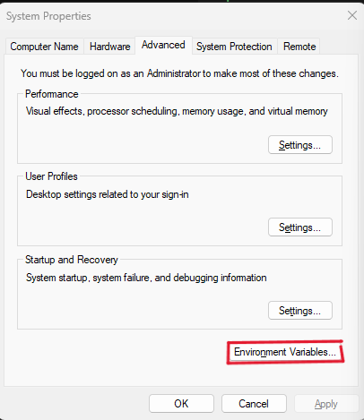
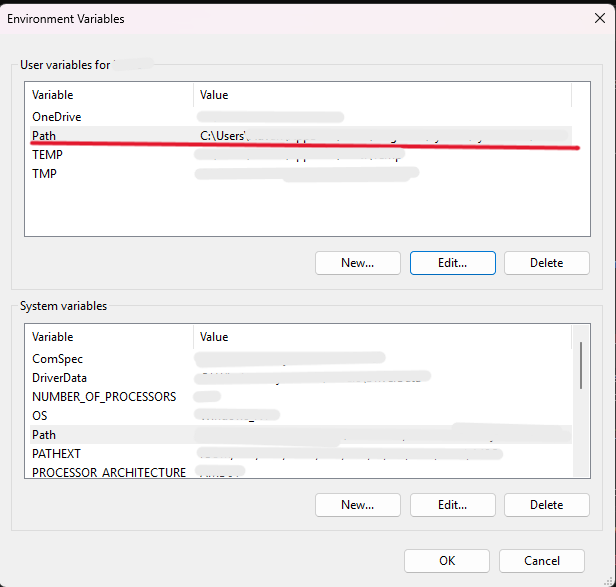
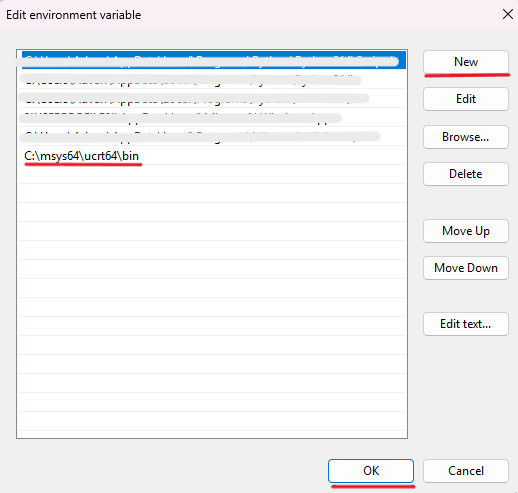
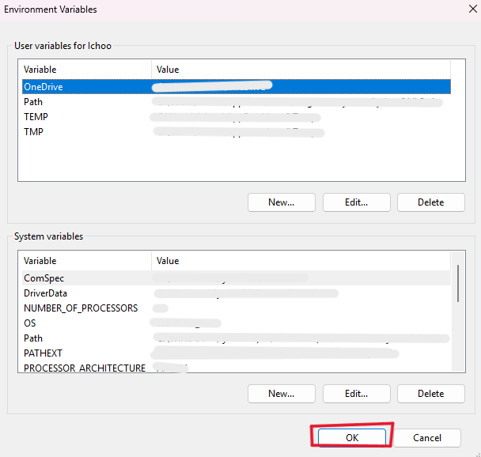
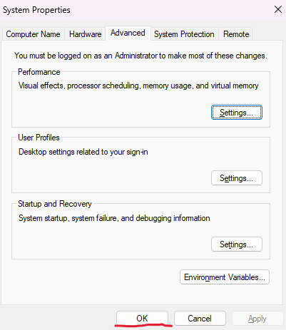

# OpenGL GLFW & GLAD Setup Guide for VS Code (WINDOWS)

Welcome to this repository! This guide provides a straightforward, logical approach to setting up a modern Computer Graphics environment using OpenGL, GLFW, and GLAD in Visual Studio Code especially in Windows.

## Prerequisites
Before proceeding, ensure your system meets the following requirements:
*   **Operating System:** Windows 10 or 11 (64-bit/32-bit).
*   **Internet Connection:** Required for downloading MSYS2 packages and GLAD generation.
*   **Editor:** Visual Studio Code installed.

## Installation Steps

### Install MSYS2 (Compiler for C/C++)
1. Install MSYS2 from the [official website](https://msys2.org). Once installed, open the **MSYS2 UCRT64** terminal and run the following command to install the MinGW-w64 toolchain:
```bash
pacman -S --needed base-devel mingw-w64-ucrt-x86_64-toolchain
```
2. Configure Environment Variables
    - Open the Windows Search bar and type `Edit the System Environment Variables`, then press Enter.
    - Click the `Environment Variables` button at the bottom.
    
    
    
    - In your `User Variables`, select the `Path` variable and the select `Edit` or double click it

    

    - Select `New` and add the ucrt64 bin folder path to the list. The default path should be: `C:\msys64\ucrt64\bin`, unless you change the installation path during MSYS2 installation setup.

    

    - Select `OK`, and then select `OK` again in the `Environment Variables` window to update the `PATH` environment variable. You have to reopen any console windows for the updated `PATH` environment variable to be available.
    
    

    

3. Open a fresh Command Prompt (CMD) or PowerShell window and run the following commands to verify that the compiler and debugger are successfully installed:
```bash
gcc --version
g++ --version
gdb --version
```


Download GLFW from glfw.org. Windows users must select 64-bit binaries. Mac/Linux users can use Homebrew or apt-get. We highly focus on Windows UCRT64 setups for seamless integrations and stability.
Generate GLAD at glad.dav1d.de. Select C/C++, OpenGL Core Profile API 3.3+. Click generate, download the ZIP file, and extract the include headers and glad.c source file into your project directory.
Install C/C++ and CMake Tools extensions in VS Code. Do not use tasks.json for pro setups; use CMakeLists.txt to automatically link GLFW and GLAD, ensuring a scalable and automated building process.
Test the environment by creating main.cpp. Initialize glfwInit() and gladLoadGLLoader(). If a blank window appears without an error, your graphical configuration is perfectly linked and ready to use.

## 📂 Project Structure
To avoid errors, ensure your project directory matches this exact structure. We use a local `dependencies` folder to isolate the library from the global system:

> 📁 Your_Project_Name
> ├── 📁 dependencies
> │   ├── 📁 include
> │   │   ├── 📁 glad
> │   │   ├── 📁 GLFW
> │   │   └── 📁 KHR
> │   ├── 📁 lib
> │   │   └── 📄 libglfw3.a
> │   └── 📁 src
> │       └── 📄 glad.c
> ├── 📁 .vscode (For manual configuration)
> │   ├── 📄 tasks.json
> │   └── 📄 launch.json
> ├── 📄 CMakeLists.txt (For automated builds)
> └── 📄 main.cpp

## 🚀 Build & Run Instructions
Depending on your preferred workflow, choose one of the following methods to run the project:

**Method A: Using Automated CMake (Recommended)**
1. Open the project folder in VS Code.
2. Ensure the `CMake Tools` extension is active.
3. Look at the bottom blue status bar in VS Code, click the **Build** button.
4. Click the **Play (Launch)** icon right next to it to run the application.

**Method B: Using tasks.json (Manual Automation)**
1. Open `main.cpp` so it becomes the active tab on your screen.
2. Go to the left panel, click the **Run and Debug** icon.
3. Select your dynamic configuration from the dropdown.
4. Click the Green Play button.
